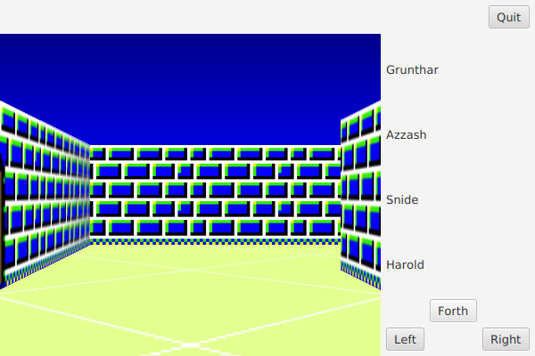
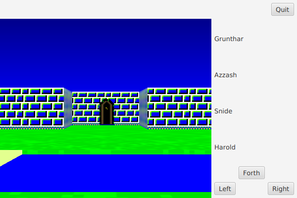

# What is alm?
alm is a first-person 3D adventure game.

## Dependencies
This program requires Java 8 with JavaFX.  I have not tested it with
previous versions of Java.

## Screenshots

## License
This is free and unencumbered software released into the public domain.
For more information, see LICENSE.
